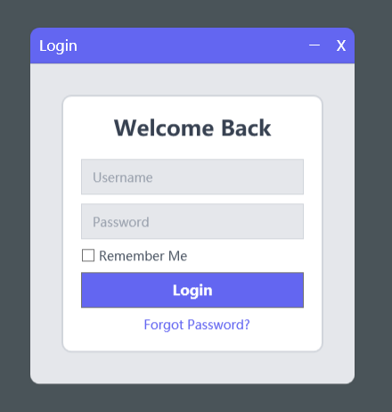
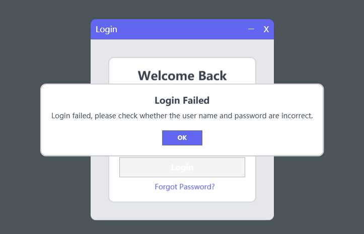

# Login.WPF.Template

## Project Overview

`Login.WPF.Template` is a WPF application designed to provide a modern login window. The project utilizes the MVVM design pattern and includes the following key features:

- **Login Functionality**: Allows users to log in by entering a username and password.
- **Remember Me Feature**: Provides an option to remember the user's login information for automatic filling in future logins.
- **Custom MessageBox**: Overwrites the default MessageBox to maintain a consistent style throughout the WPF application.

## Features

- **MVVM Design Pattern**: The project uses the MVVM design pattern to separate the view from the business logic, making the code more maintainable and extensible.
- **Login**: Users can authenticate by entering a username and password.
- **Remember Me**: Automatically fills in the username if the Remember Me option is selected.
- **Custom MessageBox**: Provides a unified message prompt style to ensure a consistent user interface.

## Screenshots

## Usage

1. Clone or download the project to your local machine.
2. Open the solution in Visual Studio.
3. Build and run the project.
4. Modify `App.xaml`, `ViewModels`, and `Views` as needed to fit specific business requirements.

## License

This project is licensed under the [MIT License](LICENSE).
