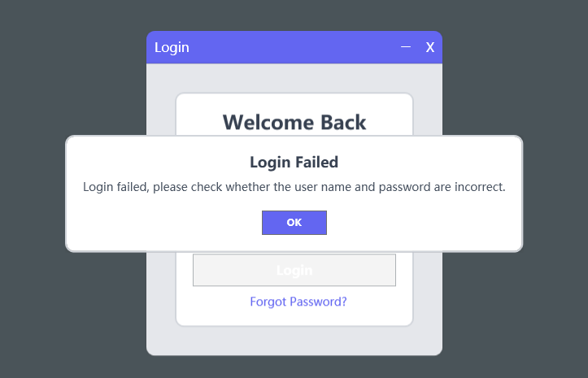

# Login.WPF.Template

## 项目简介

`Login.WPF.Template` 是一个 WPF 应用程序，主要功能是构建一个现代化的登录窗体。该项目采用了 MVVM 设计模式，提供了以下核心功能：

- **登录功能**：允许用户通过输入用户名和密码进行登录。
- **记住我功能**：提供了记住用户登录信息的选项，以便下次登录时自动填充用户信息。
- **自定义 MessageBox**：重写了 MessageBox 提示框，以统一 WPF 应用的风格和外观。

## 功能特点

- **MVVM 设计模式**：项目使用 MVVM 设计模式分离了视图和业务逻辑，使得代码更易于维护和扩展。
- **登录**：用户可以输入用户名和密码进行身份验证。
- **记住我**：选择记住我选项后，下次启动应用时自动填充用户名。
- **自定义 MessageBox**：提供了一种统一的消息提示框样式，使得应用的用户界面更具一致性。

## 窗体截图

## 使用说明

1. 克隆或下载项目到本地。
2. 使用 Visual Studio 打开解决方案。
3. 构建并运行项目。
4. 根据需要修改 `App.xaml`、`ViewModels` 和 `Views` 来适应具体的业务需求。

## 许可证

本项目采用 [MIT 许可证](LICENSE).
